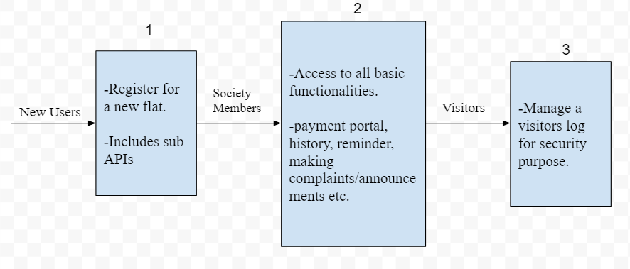
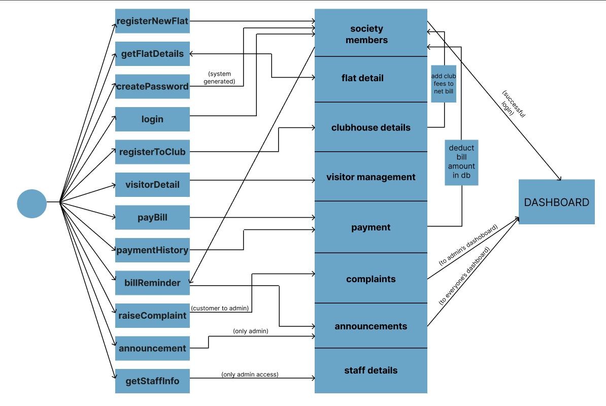
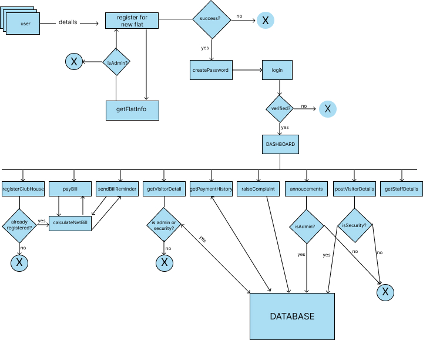

 

# **PROJECT PLANNING**

## **1. Project Design**

### **1.1 Goal**

Our end goal is to create a Society Management System which would mainly include the server side work. Since it is version 1, our application will only include the utmost necessary requirements for a flexible and secure platform. 

### **1.2 Scope**

Since, our project is only server side for now, we will primarily be focussing on smooth flow of the entire application for which multiple APIs will be created. The major milestones will be (in same sequence)-
- Register for a new flat. 
- Providing society residents with all the functionalities.
- Visitor management
- Testing

### **1.3 Tools**
### For this project, we will be using-
- Node.js
- Expess.js
- MongoDB compass for a local database which will be implemented using the mongoose library.
- Postman for API testing.

### **1.4 Milestones**
| Milestones | Description | Delivery Date |
| ---------------- | ---------------- | ---------------- |
| Register for a new flat  | Initial step for every new user.  | 26-05-23  |
| Functionalities for residents  | All the functionalities for better user experience for the society members.  | - |
| Visitor management  | For security purposes, entry of every visitor to be taken.   | - |
| Testing  | Application Testing for smooth flow of every API created | - |

### **1.5 Workflow**

## **2. Detailed Design**

### **2.1 Basic Architecture-**

### **2.2 API workflow diagram-**

### **2.3 Milestones-**

| Milestone | Description | Status |
| ---------------- | ---------------- | ---------------- |
| schema  | Create schema for different dbs required  | done  |
| Upload flat details  | Create an api that automatically inputs the details of all flats  | done  |
| getFlatDetails  | Create an api that takes wing and floor as input and returns all vacant flats that match the input condition  | done  |
| registerNewFlat  | Create an api that checks for getFlatDetails and register a flat to new client based on the output from getFlatDetails api  | done  |
| generatePassword Function  | Create a function that generates an initial password for all the new members. It must be invoked in registerNewFlat api  | done  |
| login  | Create an api that takes in id and password and logs the user in to the dashboard  | done  |
| changePassword prompt  | Prompt user to change password to its own liking. Match the id, current password and newPwd==confirmPwd  | done  |
| getMemberDetails  | Create an api to check if the caller is an admin (“role” : “admin”) to retrieve all information of the members except password | done  |
| getDetailedView  | Create an api to get the detailed view of a particular member  | done  |